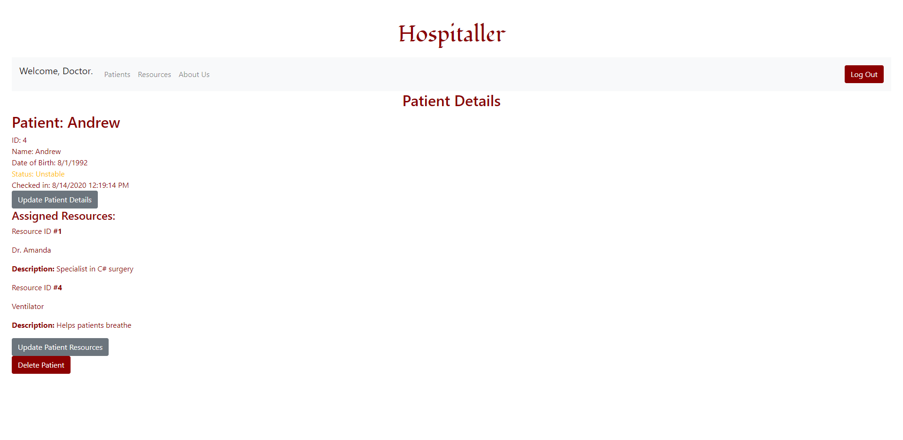

# Hospitaller

## 🏥 Project Vision
In this ongoing pandemic, Doctors and medical responders need powerful tools to coordinate and organize their efforts. 


This is Hospitaller. It is designed to deploy to a hospital or emergency  medical facility and help the doctors and first responders know the status’ of their patients, what equipment and resources they have available, and give them the ability to update that information quickly as they work to save lives.

---
### We are deployed on Azure!

https://hospitallerhealth.azurewebsites.net/

Backend deployment: https://hospitaller-api.azurewebsites.net

Backend Github: https://github.com/Team-Forky/API

---
## 🏥 Web Application

The web application consists of a frontend written in Razor views, HTML, CSS and
Bootstrap. The backend was written in C# using ASP.NET Core, Entity Framework Core, and the MVC framework.

The homepage displays the apps logo and allows the user to go to either the Patients or About Us pages. On the Patients page the user will see a list off all patients (brought from the backend and our database) and allow the user to either edit or add entries. 

[User Stories (see list in Trello)](https://trello.com/b/aGbpFaHo/untitled-hospital-app)

[Software Requirements](requirements.md)

[Domain Model](https://drive.google.com/file/d/1pY37V1fkqJCz3QhNsCDv2trf6NsCD1-A/view)

[ER Diagram](https://drive.google.com/file/d/1i9tU3tyPKcPqTN7nGmVpfJLpzK5pondw/view)


---

## 🩺 Tools Used
Microsoft Visual Studio Community 2017 (Version 15.5.7)

- C#
- ASP.Net Core
- Entity Framework
- MVC
- Bootstrap
- Azure
- Postman API

---

## Recent Updates

#### V 1.1

*Redeployed with new backend* - 8/16/2020

---

## Getting Started

Clone this repository to your local machine.

```
$ git clone https://github.com/Team-Forky/HospitalFrontEnd
```
Once downloaded, you can either use the dotnet CLI utilities or Visual Studio 2017 (or greater) to build the web application. The solution file is located in the /HospitalProjectFrontEnd subdirectory at the root of the repository.
```
cd HospitalFrontEnd/HospitalProjectFrontEnd
dotnet build
```
The dotnet tools will automatically restore any NuGet dependencies. Before running the application, the provided code-first migration will need to be applied to the SQL server of your choice configured in your user secrets file. This requires the Microsoft.EntityFrameworkCore.Tools NuGet package and can be run from the NuGet Package Manager Console:
```
Update-Database
```
Once the database has been created, the application can be run. Options for running and debugging the application using IIS Express or Kestrel are provided within Visual Studio. From the command line, the following will start an instance of the Kestrel server to host the application:
```
cd HospitalFrontEnd/HospitalProjectFrontEnd
dotnet run
```
---

## Usage

### Login Page


### Patient Overview


### Patient Details


### Resource Overview


---
## Data Flow (Frontend, Backend, REST API)
The user submits new patient data via the form on the add patients page on the frontend by clicking the button. That data is sent from the page to the matching parameters in the post action within the frontend patients controller, which sends the data into the frontend patient service. The patient service then creates a patient object from the data, starts an http client, adds headers, serializes the object to JSON, and posts that data to the backend. 

Once the request reaches the backend, the backend patients controller routes the request to the post action, which translates the attached JSON data to a patient object. The action then takes the patient object and sends it into the backend patient service. The patient service uses Entity Framework and the dbcontext to translate the data into SQL queries and enter that data into the database. Once that's complete, the backend composes the response with a success status code and sends that response back to the front end.

The front end recieves the success response in the controller and continues, redirecting the user to the patients overview page. As part of loading that page, the frontend makes another request to the backend for data on all patients. The backend retrieves that data from the database, serializes it to JSON, and sends it back to the frontend in the response body. The frontend patients controller deserializes that data to a list of patients and creates the page, using the data to populate the page. The user sees all the patients, including the one they just added.


---
## Data Model

### Overall Project Schema


---
## Model Properties and Requirements

### Patient

| Parameter | Type | 
| --- | --- | 
| ID  | int | 
| Name | string | 
| Birthday | string | 
| Status | int | 
| CheckIn | DateTime | 
| Resources | List(Resource) | 


### Resource

| Parameter | Type |
| --- | --- |
| ID  | int |
| Name | string |
| Description | string |
| ResourceType | int |

---

## Change Log
 
1.1 *Redeployed with new backend* - 8/16/2020

0.9 *Frontend and backend successfully connected* - 4/13/2020

---

## Authors

Andrew Casper

Teddy Damian

Joseph Hangarter

Matthew Johnson

---
